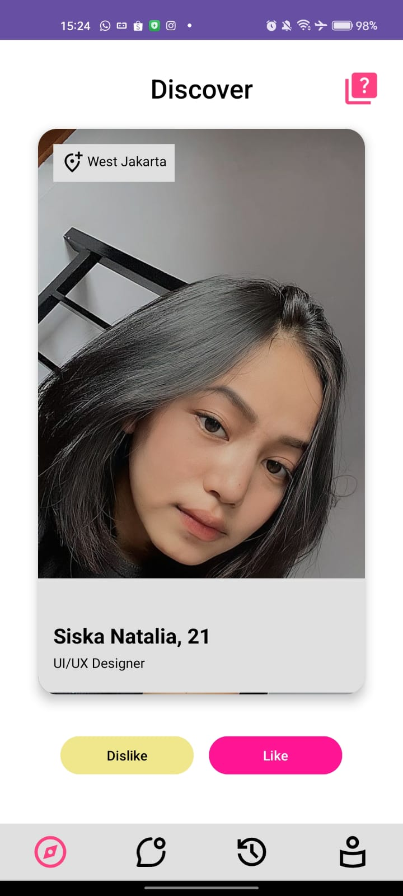
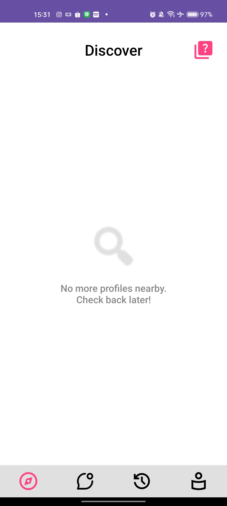
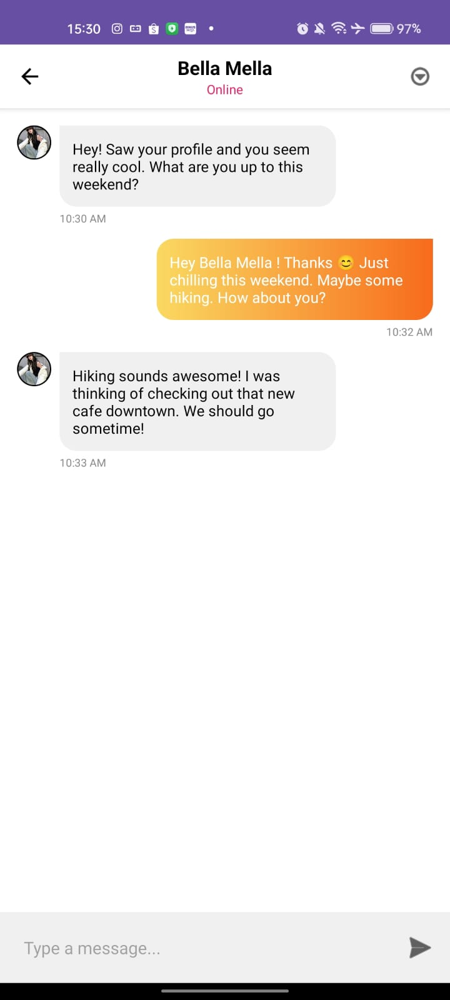
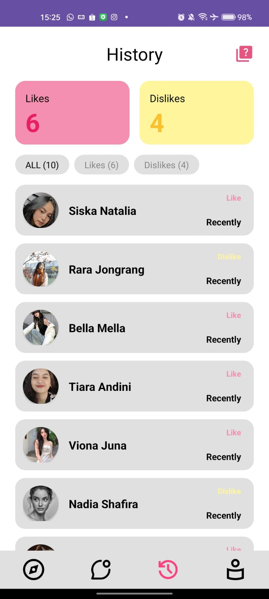
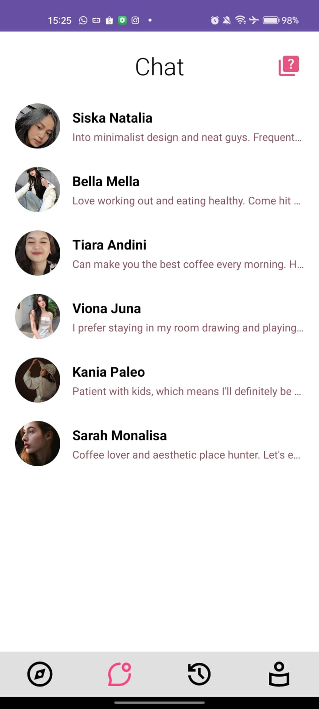
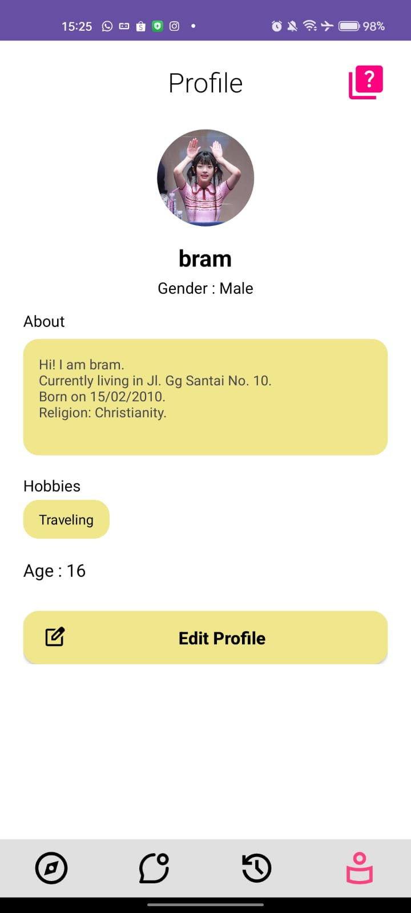

# 💖 BLATE - Modern Dating Application


BLATE is a sleek, intuitive, and interactive Android dating application designed to help users discover, connect, and chat with potential matches around them.

> **Project Context & Author's Note:**
> Originally initiated as a university group project, I (**Ignatius Abraham Aristio Kusnadi**) took the initiative to fork and heavily refactor this repository. Just like my previous Laravel project, I felt the initial group collaboration did not reach its maximum potential or meet standard industry practices. I have since independently re-engineered the data flow, polished the UI/UX, squashed persistent UI lifecycle bugs, and optimized the Firebase integration to transform it into a proper, production-ready application for my developer portfolio.

---

## ✨ Key Features

* **🔍 Discover (Swipe & Match):** Browse through potential matches with a dynamic, Tinder-like interface. Features real-time Firestore fetching and custom empty states when users run out of nearby profiles.
* **💬 Interactive Chat System:** A fully functional, real-time chat interface using `RecyclerView`. Features dynamic chat bubbles, integrated profile pictures using `CircleImageView`, and seamless data passing between activities.
* **🕒 Activity History:** A dedicated tracking page where users can review profiles they have "Liked" or "Disliked", complete with color-coded statuses.
* **👤 Profile Management:** Users can register, set up, and update their personal details, hobbies, and preferences, safely stored locally via `SharedPreferences` and synced to the cloud.
* **💡 Help Dialogs:** Context-aware help popups integrated across all major screens to guide new users.

---

## 📸 Screenshots

*(Replace the image paths below with the actual files in your repository)*

| Discover (Match) | Empty State | Chat Detail |
| :---: | :---: | :---: |
|  |  |  |

| History Page | Chat Inbox | Profile Setup |
| :---: | :---: | :---: |
|  |  |  |

---

## 🛠️ Tech Stack & Libraries

* **Frontend:** Android SDK (Java), XML Layouts
* **Backend / Database:** Google Firebase (Cloud Firestore)
* **Architecture:** MVC Pattern
* **UI Components:** Material Design Components, ConstraintLayout
* **Third-Party Libraries:**
  * `de.hdodenhof:circleimageview:3.1.0` (For perfect circular avatar rendering)

---

## 🧑‍💻 My Contributions (Ignatius Abraham Aristio Kusnadi)

As the primary developer refining this project, my specific technical contributions and commits include:

* **Chat Infrastructure:** Engineered the entire Chat feature utilizing `RecyclerView`. Mapped complex Firestore nested data into dynamic chat interfaces (`item_message_sent`, `item_message_received`) and implemented real-time profile picture binding.
* **History Tracking System:** Built the History tracking module from scratch. Designed the logic to dynamically pull "Accepted" and "Rejected" user arrays from Firestore and display them with corresponding visual UI states.
* **Profile & Navigation:** Developed the `ProfileActivity` and established a robust, memory-leak-free Bottom Navigation system (`Intent.FLAG_ACTIVITY_CLEAR_TOP`) across the application.
* **UI/UX Overhaul & Bug Squashing:**
  * Designed and integrated the global Help Dialog system.
  * Fixed critical `DayNight` theme visual glitches that caused text to disappear on dark-mode physical devices.
  * Resolved severe UI overlapping and transparency bugs during activity transitions.
  * Implemented aesthetic "Empty States" for the Discover page to improve user experience.
* **Data & Session Management:** Refactored the login and registration logic, ensuring flawless ID passing and session persistence using `SharedPreferences`.

---

## 🚀 How to Run / Installation

### Option A: For Developers (Build from Source)

1. Clone this repository
```bash
git clone https://github.com/abrahamkusnadi/BLATE.git
```
2. Open the project in Android Studio.
3. Re-sync the Gradle files to download all dependencies (including CircleImageView).
4. Note on Firebase: 
Ensure you have the google-services.json file placed in your app/ directory. (Due to security reasons, the production JSON file is not included in this public repository).
5. Build and run the app on an Emulator or a Physical Android Device (Light Mode recommended for optimal viewing).

### Option B: For Casual Testing (Quick Install)
Don't want to build it from source? You can just download the pre-compiled APK to test it directly on your Android phone. It's 100% safe to install!

📥 **[Download APP Here](https://github.com/abrahamkusnadi/BLATE/app-debug.apk)** *(Note: You may need to allow "Install from Unknown Sources" on your device settings).*

## 🚀 Future Enhancements

While BLATE is fully functional for demonstration and portfolio purposes, there is always room for growth. Future updates will focus on scaling the architecture and elevating the user experience:

* **Database Optimization & Security:** The current Firestore database is structured primarily for rapid prototyping and UI responsiveness. Future iterations will normalize the NoSQL data models for better efficiency, implement strict Firebase Security Rules, and establish a more scalable schema.
* **Advanced UI/UX & Animations:** Implementing fluid, physical swipe animations (Tinder-like card stacks) for the Discover page using `ItemTouchHelper`, adding shared element transitions, and fully supporting a dynamic Dark Mode.
* **Cloud Storage Integration:** Transitioning profile pictures from local `drawable` resources to Firebase Cloud Storage, allowing users to dynamically upload, crop, and update their actual photos.
* **Location-Based Matching:** Replacing static "domicile" strings with actual GeoQueries to filter and find matches within a specific dynamic radius.
* **Push Notifications:** Integrating Firebase Cloud Messaging (FCM) to alert users in real-time about new matches and incoming chat messages.
